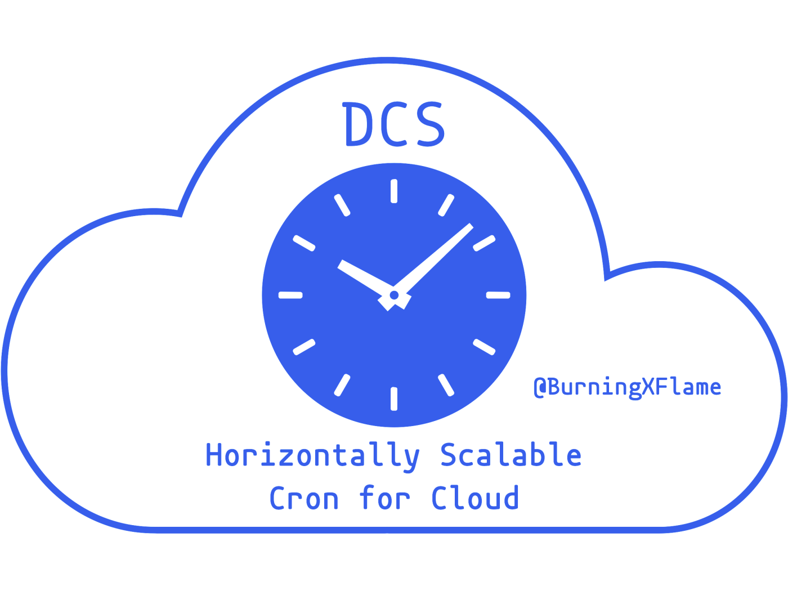

# DCS - Horizontally Scalable Cron for Cloud

DCS is a Cloud-Native Job Scheduling System that effortlessly scales with your business.

## Intro

### Features

- Cron Job
- Periodic Job
- HTTP Callback
- HTTP Callback with Header and/or Body
- TCP Callback
- Time Zone
- Time Zone Change
- Job History
- Limit Schedule Times
- Callback with Retry
- Callback with Timeout

To learn more, view the [Complete List of All Features](https://www.bxflame.com/dcs/doc/features/).

### Effortlessly Scale With Your Business

DCS effortlessly scales as your business grows. DCS is Truly Distributed, Load Balanced and Horizontally Scalable. This architecture provides the best scalability and reliability. In theory, there’s no scalability cap, i.e. you can achieve unlimited throughput by specifying an unlimited number of replicas.

### Reliability

- Zero downtime during scaling out/in.
- Zero downtime during upgrade.
- Zero downtime on time zone changes. Time zone changes are automatically detected and applied at runtime with zero downtime.
- Zero downtime on temporary errors. Auto-recover on temporary errors.
- Zero downtime on process crash. Auto-recover on process crash.

## Use

### CR

Just create a CR to define a job and that's it. The job will reliably run as expected.

Let's start with the simplest example.

```yaml
apiVersion: ext.burningxflame.github.com/v1
kind: CronJob
metadata:
  namespace: <ns>
  name: <name>
spec:
  expr: "* * * * *" # cron expression
  callback: # regularly called on the specified schedule
    http:
      url: http://<host>/<path>
```

To learn more, view the [Complete List of All Features](https://www.bxflame.com/dcs/doc/features/).

### RESTful

RESTful API is also available.

Let's take the same example as above.

- Method: `PUT`
- URL: `https://dcs:1058/jobs/<ns>/<name>`
- Header: `Content-Type: application/json`
- Body:

  ```json
  {
    "expr": "* * * * *",
    "callback": {
      "http": {
        "url": "http://<host>/<path>"
      }
    }
  }
  ```

To learn more, view the [RESTful API docs](https://www.bxflame.com/dcs/doc/rest/).
